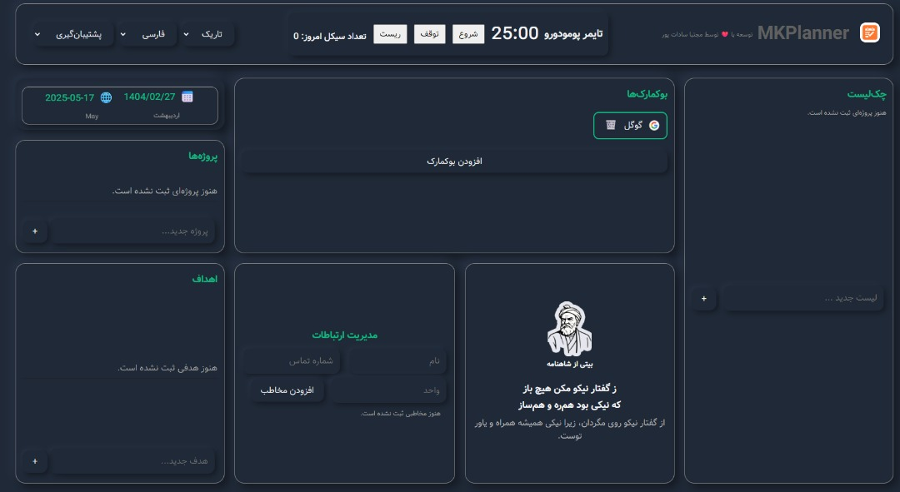

<p align="center">
  
</p>

# MKPlanner (by Mojtaba Sadatpour)

**یک افزونه کروم برای برنامه‌ریزی روزانه، مدیریت پروژه و کارها، تقویم جلالی/میلادی، پومودورو، یادداشت سریع، شعر شاهنامه و...**

---

## معرفی (Introduction)

MKPlanner یک افزونه کروم با رابط کاربری مدرن و نئومورفیک است که امکانات زیر را ارائه می‌دهد:
- برنامه‌ریز روزانه و چک‌لیست گروه‌بندی‌شده (پروژه/بخش/تسک) با آکاردئون
- تقویم جلالی/میلادی
- تایمر پومودورو
- یادداشت سریع
- نمایش شعر تصادفی از شاهنامه با معنی فارسی و انگلیسی
- حالت تاریک/روشن
- پشتیبانی از دو زبان فارسی و انگلیسی
- ذخیره‌سازی ابری (chrome.storage.sync) با fallback به localStorage
- **پشتیبان‌گیری (ایمپورت/اکسپورت) از داده‌ها**

---

## نصب افزونه (How to Install)

1. این مخزن را دانلود یا کلون کنید:
   ```
   git clone https://github.com/yourusername/MKPlanner.git
   ```
2. وارد Chrome شوید و به صفحه افزونه‌ها بروید:
   ```
   chrome://extensions/
   ```
3. گزینه **Developer mode** را فعال کنید.
4. روی **Load unpacked** کلیک کنید و پوشه پروژه را انتخاب کنید.
5. افزونه MKPlanner به نوار ابزار شما اضافه می‌شود.


## نحوه استفاده (How to Use)

- روی آیکون افزونه کلیک کنید تا داشبورد باز شود.
- از منوی بالا می‌توانید زبان و تم را تغییر دهید.
- هر بخش (برنامه‌ریز، تقویم، پومودورو، یادداشت و...) به صورت جداگانه قابل استفاده است.
- شعر شاهنامه هر روز به صورت تصادفی نمایش داده می‌شود و با تغییر زبان، معنی انگلیسی یا فارسی نمایش داده می‌شود.
- داده‌های شما به صورت ابری ذخیره می‌شود و در صورت پر شدن quota به localStorage منتقل می‌شود.
- **برای پشتیبان‌گیری (ایمپورت/اکسپورت):**
  - از منوی بالای افزونه (کنار سوئیچر زبان)، منوی کشویی «پشتیبان‌گیری» را باز کنید.
  - برای گرفتن خروجی (Export)، گزینه «خروجی گرفتن» را انتخاب کنید تا فایل بکاپ دانلود شود.
  - برای ورود اطلاعات (Import)، گزینه «ورود اطلاعات» را انتخاب و فایل بکاپ (فرمت JSON) را انتخاب کنید.
  - پس از تأیید، داده‌های شما جایگزین می‌شود.

---

## ویژگی‌ها (Features)

- **Project Checklist**: مدیریت پروژه‌ها، بخش‌ها و تسک‌ها به صورت گروه‌بندی و آکاردئونی
- **Daily Planner**: مدیریت کارهای روزانه با قابلیت افزودن، ویرایش و حذف
- **Jalali/Gregorian Calendar**: نمایش تاریخ شمسی و میلادی
- **Pomodoro Timer**: تایمر با دکمه‌های شروع، توقف و ریست (Start, Stop, Reset)
- **Quick Notes**: یادداشت سریع
- **Shahnameh Poetry**: نمایش شعر تصادفی با معنی فارسی و انگلیسی
- **Dark/Light Mode**: تغییر تم
- **i18n**: پشتیبانی کامل از فارسی و انگلیسی
- **Cloud Sync**: ذخیره‌سازی ابری با chrome.storage.sync
- **Backup/Restore**: ایمپورت و اکسپورت داده‌ها با یک کلیک
- **رابط کاربری مینیمال و واکنش‌گرا**

---

## نکات مهم (Notes)
- افزونه به صورت popup اجرا می‌شود و قابلیت new tab فقط در حالت عادی فعال است.
- برای استفاده در Incognito باید به صورت دستی فعال شود.
- اگر با خطای quota مواجه شدید، داده‌ها به صورت محلی ذخیره می‌شوند.
- برای گزارش باگ یا پیشنهاد، به [sadatpour.com](https://sadatpour.com) مراجعه کنید.

---

## سوالات متداول پشتیبان‌گیری (FAQ Backup)
- **آیا با ایمپورت، داده‌های قبلی حذف می‌شود؟**
  بله، داده‌های فعلی با داده‌های فایل بکاپ جایگزین می‌شود.
- **فرمت فایل بکاپ چیست؟**
  فایل بکاپ با فرمت JSON است و فقط از طریق همین افزونه قابل استفاده است.
- **آیا می‌توانم بکاپ را به دستگاه دیگر منتقل کنم؟**
  بله، کافیست فایل را در دستگاه جدید ایمپورت کنید.

---

## Developer
- [Mojtaba Sadatpour](https://sadatpour.com)

---

### English

# MKPlanner (Moji Planner)
A modern Chrome extension for daily planning, project/section/task checklist, Jalali/Gregorian calendar, Pomodoro timer, quick notes, random Shahnameh poetry, and more.

## Features
- Project/Section/Task checklist with accordion UI
- Daily planner & checklist
- Jalali/Gregorian calendar
- Pomodoro timer (Start, Stop, Reset)
- Quick notes
- Random Shahnameh verse with Persian & English meaning
- Dark/Light mode
- Full i18n (English & Persian)
- Cloud sync (chrome.storage.sync with localStorage fallback)
- **Backup/Restore (import/export) from the header menu**
- Minimal, responsive UI

## Installation
1. Download or clone this repo:
   ```
   git clone https://github.com/yourusername/MKPlanner.git
   ```
2. Go to Chrome extensions page:
   ```
   chrome://extensions/
   ```
3. Enable **Developer mode**.
4. Click **Load unpacked** and select the project folder.
5. MKPlanner will appear in your toolbar.

> **Note:**
> - To use in Incognito, enable it manually from the extensions page.
> - chrome_url_overrides for new tab only works in normal mode, not Incognito.

## Usage
- Click the extension icon to open the dashboard.
- Change language and theme from the top menu.
- Each section (planner, calendar, pomodoro, notes, poetry) is independent.
- A random Shahnameh verse is shown daily, with meaning in the selected language.
- Your data is synced to the cloud, with local fallback if quota is exceeded.
- **To backup or restore your data:**
  - Use the "Backup" dropdown menu in the header (next to the language switcher).
  - Select "Export" to download a backup file (JSON).
  - Select "Import" to upload a backup file and restore your data (your current data will be replaced).

## FAQ (Backup/Restore)
- **Will import overwrite my current data?**
  Yes, importing a backup will replace your current data.
- **What is the backup file format?**
  It's a JSON file, only usable with this extension.
- **Can I transfer my backup to another device?**
  Yes, just import the file on the new device.

## Support
For bug reports or suggestions, visit [sadatpour.com](https://sadatpour.com) 